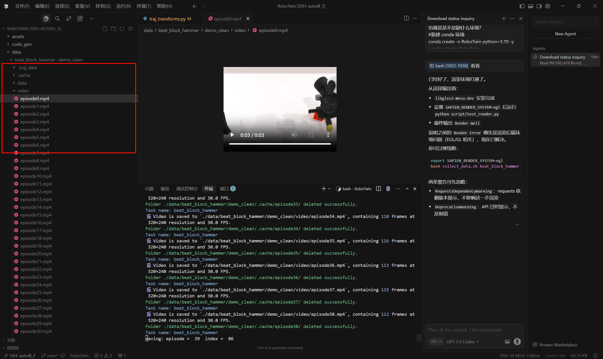
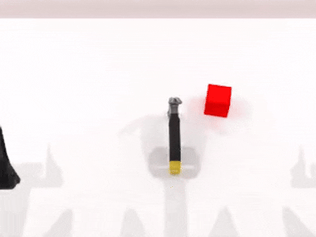
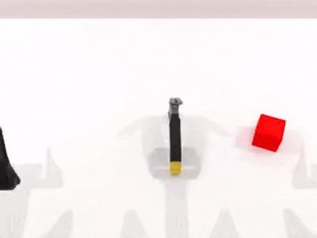
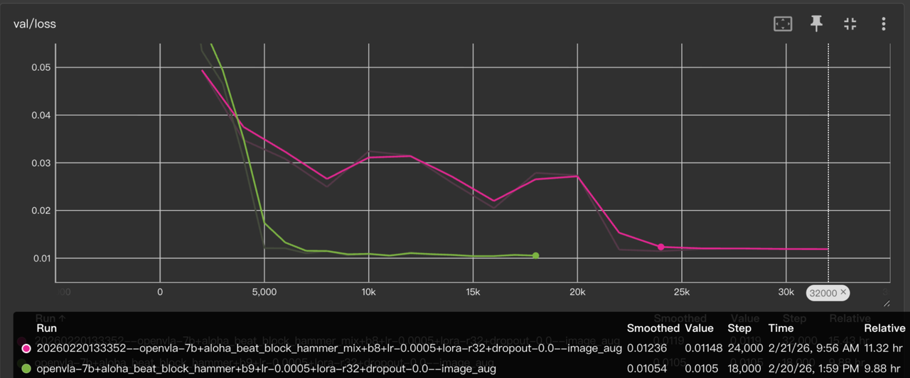
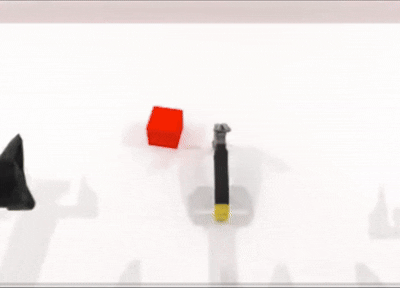

# OpenVLA-RoboTwin-Finetuning

基于 RoboTwin 仿真平台和 OpenVLA-oft 的双臂机器人端到端控制微调实践仓库。  
仓库重点覆盖完整工程链路：数据采集、数据转换、RLDS 构建、分布式训练、LoRA 合并与评测。

## 一句话介绍（简历可用）

在 RoboTwin 仿真环境中复现并工程化 OpenVLA-oft 微调流程，完成从专家数据采集到 7B VLA 分布式训练与评测闭环，并针对末端 action-chunk 数据缺失问题做数据管线修复。

## 简历包装（可直接复用）

### VLA 分布式训练实践

VLA 是基于多模态大模型的机器人端到端控制模型，在自主机器人尤其是 manipulation 任务中已成为研究热点。  
本项目聚焦 LLaVA 架构与自回归 VLA 模型，基于 OpenVLA 开源实现 OpenVLA-oft 的完整复现，包括仿真数据生成、模型训练与评测，最终实现仿真环境中的双臂机器人端到端控制。

1. **OpenVLA-oft 架构实现**  
   基于 OpenVLA 权重与代码实现 OFT：构造 empty action embeddings 以支持并行编码；构造 action head，输入最后一层 attention 激活并通过 L1 回归预测 action chunk；将多视角图像与本体感觉投影到原模型 embedding 维度并拼接到输入序列。
2. **基于 RoboTwin 的数据自动生成**  
   使用 RoboTwin 专家策略生成 ALOHA 双臂单任务数据，并加入域随机化增强多样性；生成约 500 条专家轨迹；随后将数据转换为 OpenVLA 训练可用的 RLDS 格式并划分训练/验证集。
3. **分布式训练与评测**  
   对约 7.5B OFT 模型进行 LoRA 微调，采用单机 4x4090 + FSDP 分布式训练；约 40k step 收敛，在测试集达到约 83% 成功率。

## 项目亮点

- 端到端工程闭环：数据采集 -> 数据转换 -> RLDS 构建 -> 分布式训练 -> LoRA 合并 -> 仿真评测
- 大模型训练工程：围绕 7B VLA 显存瓶颈，采用 LoRA + 多卡 FSDP
- 多模态输入适配：多视角图像与 proprio 接入 OpenVLA-oft
- 数据质量修复：修复轨迹末尾样本裁剪问题，提升末段状态学习覆盖度
- 文档化与可解释：提供流程图与 shape 流图（`doc/*.d2`）

## 技术栈

- 仿真与数据：RoboTwin、HDF5、RLDS、TensorFlow Data pipeline
- 训练与模型：PyTorch、Transformers、PEFT(LoRA)、FSDP、FlashAttention
- 工程与实验：Shell、Conda、ModelScope、TensorBoard

## 项目内容

- OpenVLA-oft 微调流程实现（含 LoRA、多视角图像与 proprio 输入）。
- RoboTwin 专家策略数据采集与预处理。
- RoboTwin 原始数据到 OpenVLA 训练所需 RLDS 格式转换。
- 单机多卡训练（推荐 FSDP）与评测脚本。
- 训练流程图与数据形状流图（`doc/*.d2`）。

## 目录概览

```text
.
├─ data/
│  └─ README_rawdata.md
├─ doc/
│  ├─ finetune_simple_flow.d2
│  └─ total.d2
├─ policy/openvla-oft/
│  ├─ datasets/
│  │  └─ robotwin_builder.py
│  ├─ prismatic/vla/datasets/rlds/
│  │  └─ traj_transforms.py
│  ├─ vla-scripts/
│  │  └─ finetune_simple.py
│  ├─ finetune_aloha.sh
│  ├─ merge_lora.sh
│  └─ eval.sh
└─ README.md
```

## 环境与算力要求

- 操作系统：Linux（推荐 Ubuntu）或等价云环境。
- Python：3.10（建议 conda 环境）。
- GPU：训练推荐 **4x RTX 4090 (24GB)**；7B 模型单卡/少卡容易 OOM。
- 兼容提示：目前实践中建议使用 4090，5090 与 RoboTwin 可能存在兼容问题。
- 时间成本：4x4090 训练单任务到官方建议的 100k step，通常需 300h+。

> 实操建议：跑通全流程并稳定训练约 100 step 即可验证工程能力，完整收敛主要受算力限制。

## 面试讲解主线（建议）

- **为什么做**：验证 VLA 在双臂 manipulation 任务上的端到端可行性与稳定性。
- **怎么做**：先做数据闭环，再做训练闭环，最后定位并修复末段失败问题。
- **难点在哪**：7B 模型显存压力、数据格式对齐、action chunk 监督覆盖不足。
- **你的贡献**：打通训练链路、完成 FSDP 训练实践、修复 `traj_transforms.py` 末尾样本逻辑。

## 快速开始

### 1) 安装 RoboTwin 环境

参考官方文档完成 Vulkan 与 RoboTwin 安装：  
`https://robotwin-platform.github.io/doc/usage/robotwin-install.html`

示例：

```bash
conda create -n RoboTwin python=3.10 -y
conda activate RoboTwin

cd /root/autodl-tmp
git clone https://github.com/Aiclass2026/RoboTwin.git
cd RoboTwin

# 可选：镜像站不走代理
export no_proxy="mirrors.aliyun.com,hf-mirror.com,localhost,127.0.0.1"

conda install pysocks -y
apt update && apt install ffmpeg -y
pip install -r script/requirements.txt
bash script/_install.sh

# 下载 3D 资源（建议关闭代理）
HF_ENDPOINT=https://hf-mirror.com bash script/_download_assets.sh
```

> 注：安装过程中若 `pytorch3d` 失败，可忽略（本流程不依赖该库）。

<p align="center">
  
</p>

### 1.1) 环境自检（RoboTwin）

```bash
bash collect_data.sh beat_block_hammer demo_clean 0
```

<p align="center">
  
</p>

### 2) 安装 OpenVLA-oft 依赖

```bash
cd policy/openvla-oft
conda activate RoboTwin
pip install -e .

pip install packaging ninja
ninja --version
pip install "flash-attn==2.5.5" --no-build-isolation
```

### 2.1) 下载 OpenVLA 权重

```bash
pip install modelscope
modelscope download --model zixiaoBios/openvla-7b --local_dir /root/autodl-tmp/OpenVLA-7B/
```

### 3) 数据采集

任务列表：`https://robotwin-platform.github.io/doc/tasks/index.html`

```bash
# 参数：任务名 配置名 渲染GPU id
bash collect_data.sh beat_block_hammer demo_clean 0
```

可选配置：
- `demo_clean`：无域随机化
- `demo_randomized`：有域随机化

配置说明：`https://robotwin-platform.github.io/doc/usage/configurations.html`

<p align="center">
  
  
</p>

### 4) 数据转换（RoboTwin -> RLDS）

```bash
cd policy/openvla-oft

python preprocess_aloha.py \
  --dataset_path /path/to/raw/data \
  --out_base_dir /path/to/oft-processed \
  --instruction_dir /path/to/instructions

python datasets/robotwin_builder.py \
  --task_name beat_block_hammer \
  --data_dir /path/to/oft-processed \
  --save_path /path/to/oft-rlds
```

数据转换与适配细节见：`data/README_convert.md`。

### 5) 启动训练

先在 `finetune_aloha.sh` 中修改模型路径、数据路径和超参数，再运行：

```bash
cd policy/openvla-oft
bash finetune_aloha.sh
```

训练过程可通过验证集 loss 与任务成功率判断收敛趋势：

<p align="center">
  
</p>

### 6) 合并 LoRA 权重

```bash
cd policy/openvla-oft
bash merge_lora.sh \
  /path/to/openvla \
  /path/to/lora_ckpt_dir \
  /path/to/merged_ckpt_dir
```

### 7) 评测模型

```bash
cd policy/openvla-oft
bash eval.sh beat_block_hammer demo_clean /path/to/merged_or_downloaded_ckpt 0 0 aloha_beat_block_hammer
```

如果只想快速复现实验链路，可以直接使用公开可下载权重进行 eval，不必等待完整训练结束。

## 关键修复：轨迹末尾数据保留

### 问题背景

在 OpenVLA-oft 的 ALOHA 评测中，曾出现稳定可复现现象：
- 任务前半程动作质量较好；
- 接近成功阶段时容易重复相似动作，出现“末段循环”；
- 失败集中在最后一个 action chunk 附近。

合理怀疑为末端状态训练覆盖不足。  
在 action-chunk 训练中，原始实现对轨迹末尾时刻做了裁剪：

```python
effective_traj_len = traj_len - future_action_window_size
```

训练配置中：
- `window_size = 1`
- `future_action_window_size = NUM_ACTIONS_CHUNK - 1`
- ALOHA 下 `NUM_ACTIONS_CHUNK = 25`，即 `future_action_window_size = 24`

因此每条轨迹最后 24 个时刻不会成为训练样本锚点（不会作为“当前观测”参与学习）。

### 修复方式

文件：`policy/openvla-oft/prismatic/vla/datasets/rlds/traj_transforms.py`

将有效轨迹长度改为全长：

```python
effective_traj_len = traj_len
```

在未来动作不足一个完整 chunk 时，索引逻辑会用最后有效 action 补齐（repeat-last），从而保持张量形状与下游接口一致，不改模型结构、不改损失函数、不改评测逻辑。

### 对比结果

- V0（baseline）：丢弃末端 action
- V1（patched）：保留末端 action + repeat-last
- 在相同数据、模型、超参数、训练步数和评测配置下，V1 成功率提升到约 80%+，末段循环现象显著缓解

<p align="center">
  
  
</p>

## 域随机化与鲁棒性观察

训练数据中是否引入域随机化及其占比，会明显影响收敛速度与策略鲁棒性。  
下图示例展示了 clean 数据与 clean+randomized 混合训练的收敛差异：

<p align="center">
  
</p>

## 可视化与文档

- 训练流程与数据形状流：`doc/finetune_simple_flow.d2`
- 项目整体流程图：`doc/total.d2`

## License

本仓库使用 MIT License，详见 `LICENSE`。
